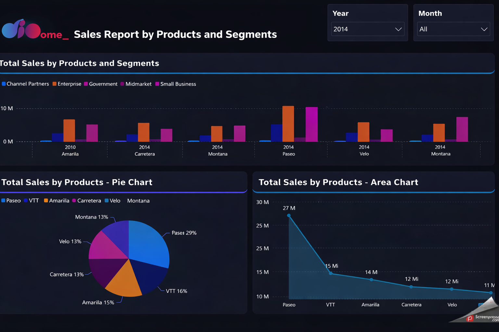
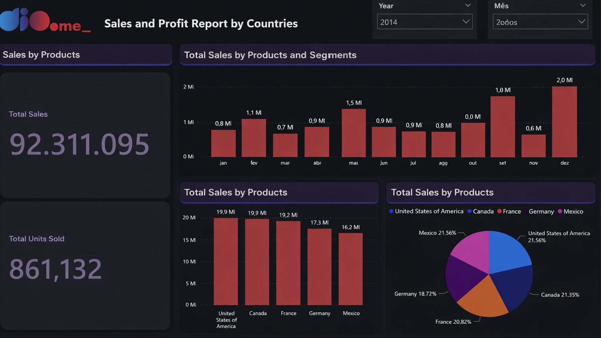
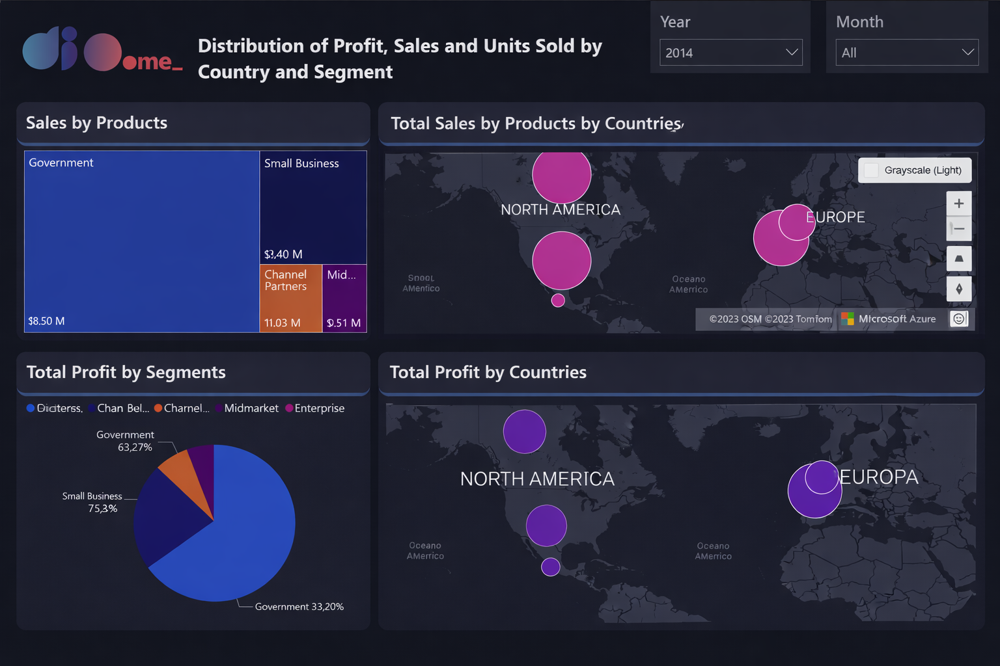

Daily learning

# Analyzing Sales Dashboard Data in Power BI

Project developed at the Bootcamp Power BI Analyst Training, under the guidance of specialist [Juliana Zanelatto](https://github.com/julianazanelatto/ "Juliana Zanelatto").

Instructions for submission:

Challenge Description:

In this project, you will replicate two pages already created during the course using the provided sample. The third page should contain some visuals. This challenge aims to train your visual creation skills. This way, you can become familiar with these resources. In more advanced modules, we will address the more elaborate layout of our reports.

Very well, the third page consists of:

- Map visual 1: Sum of sales and units sold by country

- Map visual 2: Sum of profit by country

- Pie chart visual: Profit by segment

[LICENSE](/LICENSE)

See [original repository](https://github.com/julianazanelatto/power_bi_analyst).
